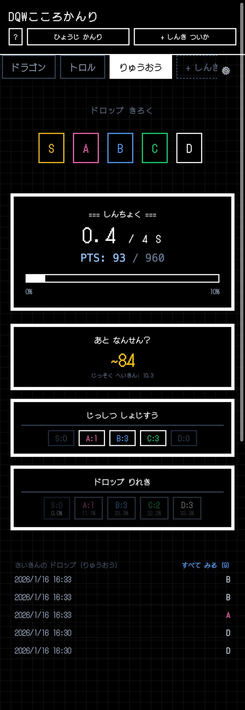

# DQW Kokoro Manager

A fan-made companion app for **Dragon Quest Walk** designed to track and optimize your Monster Heart (Kokoro) progress.

This application helps players calculate exactly how close they are to obtaining an **S Rank** heart by tracking drops and applying the game's synthesis rules.



## 🐉 Features

*   **Progress Tracking**: Visualize your progress towards an S Rank heart in real-time.
*   **Drop Logging**: Quickly record drops (S/A/B/C/D) with a single tap.
*   **Auto Synthesis Calculator**: Automatically calculates your "Virtual S Count" by simulating synthesis from lower rank hearts (e.g., 4 Ds → 1 C).
*   **Battle Estimates**: Predicts how many battles remain to reach your goal based on expected drop values.
*   **Custom Synthesis Rules**: Supports variable synthesis requirements (e.g., some monsters need 3 As for an S, others need 4 or 5).
*   **Multi-Monster Management**: Track multiple target monsters simultaneously.
*   **Retro RPG Design**: Features a pixel-art aesthetic with DotGothic16 typography.
*   **Offline Ready**: All data is persisted locally in your browser.

## 🚀 Getting Started

1.  **Add a Target**: Click **Add New** and enter the monster's name and synthesis cost (e.g., how many A's to make an S).
2.  **Log Drops**: Whenever you get a drop in-game, tap and drag or click the corresponding rank button.
3.  **Monitor Progress**: The dashboard shows your current inventory, effective points, and estimated remaining grind.

## 🛠️ Tech Stack

Built with modern web standards for performance and developer experience:

*   [React 19](https://react.dev/) - UI Library
*   [Vite](https://vitejs.dev/) - Build Tool
*   [Tailwind CSS](https://tailwindcss.com/) - Styling
*   [Firebase](https://firebase.google.com/) - Hosting

## 💻 Running Locally

To run this project on your local machine:

```bash
# Install dependencies
npm install

# Start development server
npm run dev
```

Build for production:

```bash
npm run build
```

## 📝 License

This project is open source.

---

*Disclaimer: This is an unofficial fan application and is not affiliated with, endorsed, sponsored, or specifically approved by Square Enix or the Dragon Quest Walk team.*
